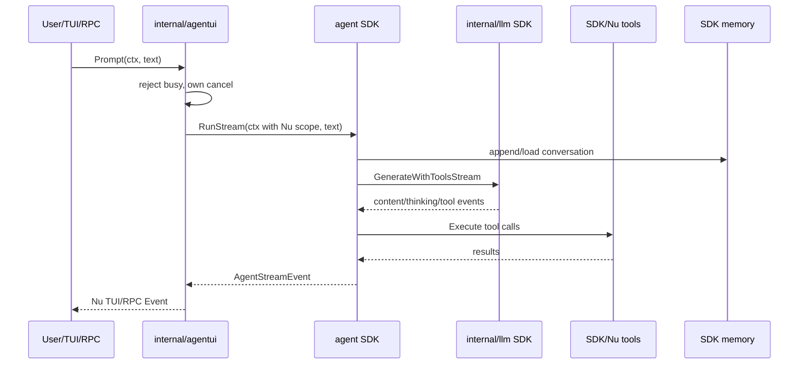

# Nu Agent Run Flow

`internal/agentui` never calls `internal/llm` or tools. SDK Agent owns all loop
continuations. Abort cancels the context. Model switch rebuilds Agent with the
same memory and tools only while idle.
